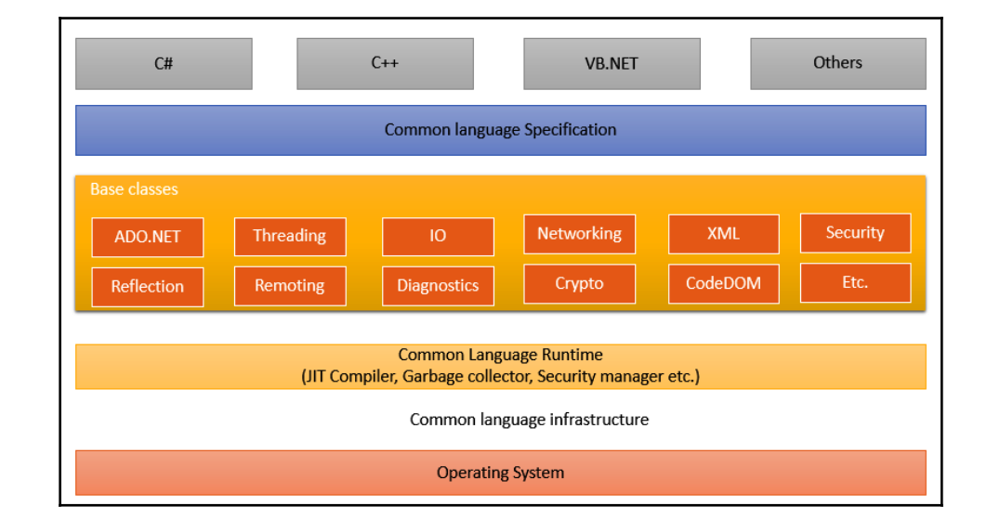

# C(Hashtag)

C Sharp, or as I like to call it C Hashtag, an OOP lang features some of the modern lang features like:
- Garbage Collector
- Nullable Types
- Exception Handling
- Lambda Expressions
- LINQ (Language Integrated Query) Syntax creates a common pattern for working with data from any source.
- Async Operations
- User Defined Reference types and value types
- Dynamic allocation of objects
- Generics
- Iterators

In the upcoming days, I will be showcasing how I follow the docs to learn a language and do some projects.

Since C# runs on top of .NET, we have to talk about the .NET architecture

## .NET Architecture
C# programs run on .NET, which is a virtual execution system called the common language runtime (CLR). The CLR is the implementation by Microsoft of the common language infrastructure (CLI), an international standard. The CLI is the basis for creating execution and development environments in which languages and libraries work together seamlessly.

C# compiles programs into itermediate language (IL) that conforms to the CLI specification. The IL code and resources, such as bitmaps and strings, are stored in an assembly, typically with an extension of .dll. An assembly contains a manifest that provides information about the assembly's types, version, and culture.

./program (C#) --> the assembly is loaded into the CLR --> CLR performs JIT compilation --> IL 



## Compiling and running a C# program
For some reasons (idk why this happens), you have to create a new project to be able to run and compile C# apps.

1. Create an new console application
```bash
dotnet new console
```

2. Run it
```bash
dotnet run
```

## Into the datatypes

Since C# is a OOP based language, Classes is everywhere, but for someone coming from non OOP languages like Go (structs) stucts are the way to go here, fortunately C# has both.

1. A `class` type defines a data structure that contains data members (fields) and function members (methods, properties, and others). Class types support single inheritance and polymorphism, mechanisms whereby derived classes can extend and specialize base classes.

2. A `struct` type is similar to a class type in that it represents a structure with data members and function members. However, unlike classes, structs are `value types` and don't typically require heap allocation. 


C# also supports the general (we all know and use) types:
- Simple types : Signed (`short, int, long`), Unsigned (`ushort, uint, ulong`), Unicode chars (`char`), Numbers (`decimal, float, double`), Booleans ('bool')
- Enums (`enum S {}`)
- Structs (`struct S {}`)
- Tuples (`(S1, S2)`)
- Nulls (`null`)

The reference types:
- Class (`object, string (yes strings are reference types here)`)
- Interfaces
- Arrays
- Delegate types: user defined types (`delegate int S (...)`)

## Program Stucture
The key organizational concepts in C# are programs, namespaces, types, members, and assemblies. Programs declare types, which contain members and can be organized into namespaces. Classes, structs, and interfaces are examples of types. Fields, methods, properties, and events are examples of members. When C# programs are compiled, they're physically packaged into assemblies. Assemblies typically have the file extension .exe or .dll, depending on whether they implement applications or libraries, respectively.

Example with generics:
```cs
namespace Acme.Collections;

public class Stack<T>
{
    Entry _top;

    public void Push(T data)
    {
        _top = new Entry(_top, data);
    }

    public T Pop()
    {
        if (_top == null)
        {
            throw new InvalidOperationException();
        }
        T result = _top.Data;
        _top = _top.Next;

        return result;
    }

    class Entry
    {
        public Entry Next { get; set; }
        public T Data { get; set; }

        public Entry(Entry next, T data)
        {
            Next = next;
            Data = data;
        }
    }
}
```

Accessing the class Stack, using the path : `Acme.Collections.Stack` from the assembly `acme.dll` for example: 
```cs
class Example
{
    public static void Main()
    {
        var s = new Acme.Collections.Stack<int>();
        s.Push(1); // stack contains 1
        s.Push(10); // stack contains 1, 10
        s.Push(100); // stack contains 1, 10, 100
        Console.WriteLine(s.Pop()); // stack contains 1, 10
        Console.WriteLine(s.Pop()); // stack contains 1
        Console.WriteLine(s.Pop()); // stack is empty
    }
}
```

## Types and Members
C# supports the concepts of `encapsulation`, `inheritance`, and `polymorphism`.
- A class inherites from one parent class. (just one)
- A class can implement any number of interfaces.
- Methods that override virtual methods in a parent class require the `override` keyword as a way to avoid accidental redefinition.
- C# provides record class and record struct types, which are types whose purpose is primarily storing data values.

### Classes and Objects
```
public class Point
{
    // setters and getters
    public int X { get; }
    public int Y { get; }
    // access modifiers
    private 
    
    public Point(int x, int y) => (X, Y) = (x, y);
}
```
To create objects from this class : 
```
var p1 = new Point(0, 0);
var p2 = new Point(10, 20);

// also you can do this
Point p1 = new Point(2, 2);
```
## C# program building blocks
The previous types (in examples) are built using these building blocks:
- Members (such as Properties, fields, methods and events)
- Expressions
- Statements

### Members 

The members of a class are either static members or instance members. 
Static members belong to classes, and instance members belong to objects (instances of classes).

```cs
public class MathUtility
{
    // static memebers
    public static int Add(int a, int b)
    {
        return a + b;
    }
}

public class Car
{
    public string Model;

    public void StartEngine()
    {
        Console.WriteLine($"The {Model} engine is started.");
    }
}

// Creating an instance of the class
Car myCar = new Car();
myCar.Model = "Toyota";

// Calling an instance method
myCar.StartEngine();
```

A class can contain:
- Constants: Constant values associated with the class
- Fields: Variables that are associated with the class
- Methods: Actions that can be performed by the class
- Properties: Actions associated with reading and writing named properties of the class
- Indexers: Actions associated with indexing instances of the class like an array
- Events: Notifications that can be generated by the class
- Operators: Conversions and expression operators supported by the class
- Constructors: Actions required to initialize instances of the class or the class itself
- Finalizers: Actions done before instances of the class are permanently discarded
- Types: Nested types declared by the class
